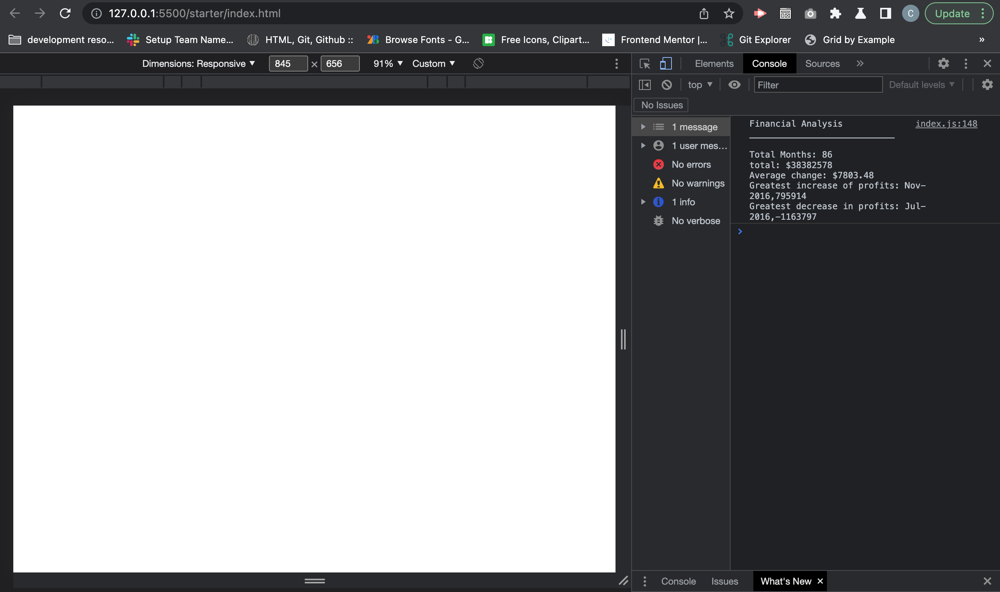
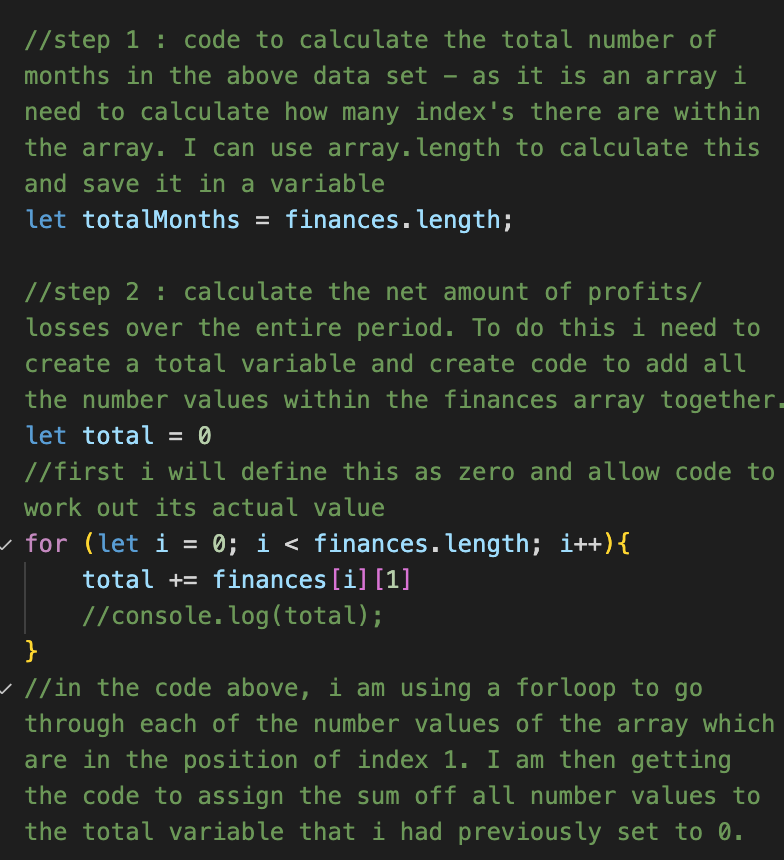
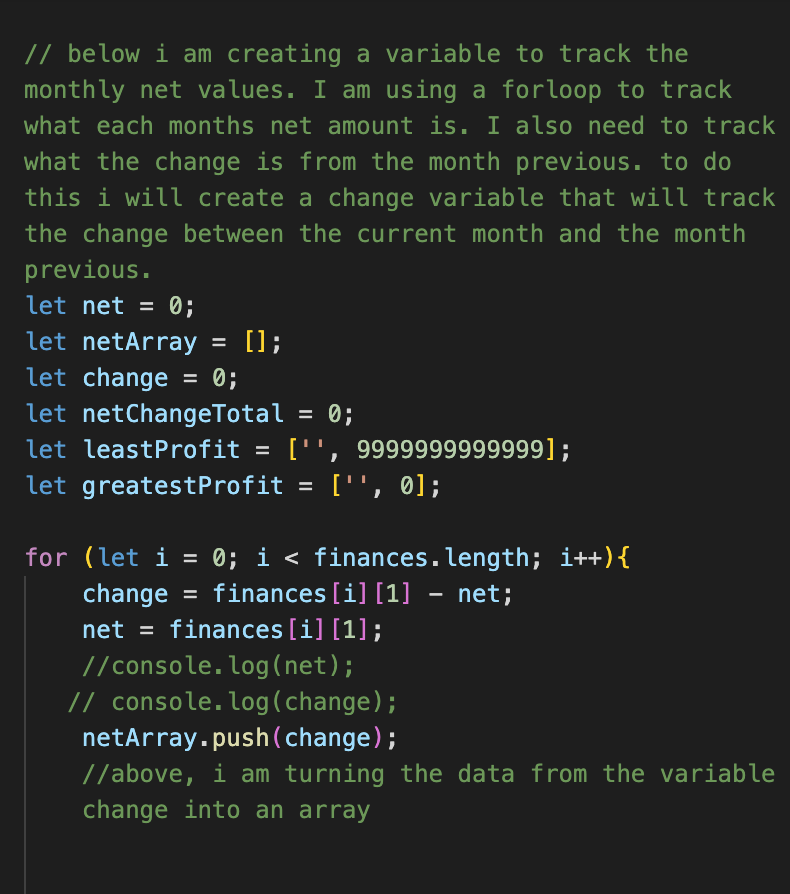
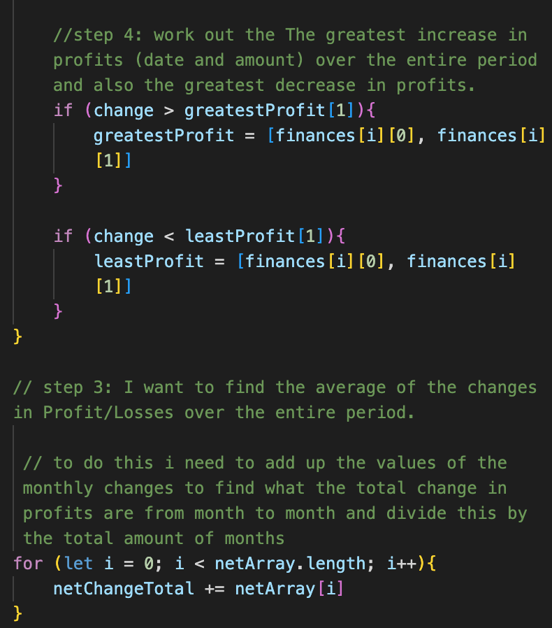

# Console-Finances
This repo contains the files and work for the week 4 challenge set by the Front end web development course

## Description
In this challenge i had to use Javascript concepts that I had learned during the week to create code that would analyse financial data from a company. 
 I was provided a dataset in the form of a nested array that contained the comapnies monthly profits/losses.

  My first task was to calculate how many months there were in the data set. I found this easy to do as i could create a variable that was equal to the arrays length. I realised that i could also use a forloop here to go through the array and print to the console the amount of data sets in the array and could also then save the results from this into a variable. However this results in more code which is not needed.
  
  The second task was abit more difficult as i had to find a way to grab the second piece of data in each nested array (index 1) and add all the values together and save the result in a variable. I knew i would have to use a forloop for this and find a way to only target the second piece of data, to do this i used bracket notation. However I seen that in the speed runs Drew had used an if/ if else statement to search for the data that wasnt a string. I found this to be an interesting way to rethink this task as i wouldnt have thought to do this.

  To finish the rest of the tasks i had to use the speed runs as i found it difficult to think of ways around the problem. The greatest difficulty I had with this was mostly due to the terminology used within the task description, this lead to me not being able to work out exactly what i needed to write code to do as i myself didnt know what i was looking for.
   I did however find that while watching the speed runs that i understood what the Javascript was doing (but it did take a while to wrap my head around, and i needed to research some more).

With this task I didnt commit my work as i was completing it as i found myself too focued on wrting the code and researching that i done it in one long sitting; I was abit worried that if i was to break concentration that i would end up getting too confused. I also think that due to not seeing visual changes like i would if i was creating a webpage with html and css, that committing the work wasnt in my mind to do. This will be something that i will be more mindful with in the future. 

## Table of Contents

- [Installation](#installation)
- [Screenshots](#screenshots)
- [License](#license)

## Installation

No need to install anything to view this project; you can view it [here](https://chriskeno95.github.io/bootstrap-portfolio-site/)

## Screenshots

## License

MIT licence

---

© 2022 edX Boot Camps LLC. Confidential and Proprietary. All Rights Reserved.

